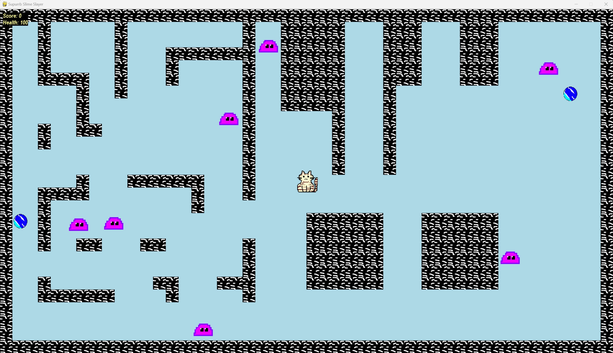

# Supurrb Slime Slayer



Supurrb (Not a Typo) Slime Slayer is a 2D pixel-style game built with Python and Pygame. The goal of the game is to survive as long as possible while fending off spawning slimes and collecting orbs. You control the cat character and can shoot projectiles to eliminate enemies.

## Table of Contents
- [Built With](#built-with)
- [Prerequisites](#prerequisites)
- [Installation](#installation)
- [How to Play](#how-to-play)
- [Game Features](#game-features)
- [Project Structure](#project-structure)
- [License](#license)

## Built With

- Python
- Pygame

## Prerequisites

- Python version 3.11
- Pygame version 2.5.1

 ## Installation

1. Clone the repository to your local machine:

    ```bash
    git clone https://github.com/petitoa/Supurrb-Slime-Slayer.git
## How to Play
- Use keys to move the cat character (W, A, S, D).
- Press the arrow keys to shoot projectiles in the corresponding directions.
- Survive as long as possible by killing slimes and collecting orbs.
- Your score increases by defeating slimes and collecting orbs.
- If your health reaches 0, your score is reset and your health is set back to 100.

## Game Features
- 2D sprite-style graphics.
- time-based enemy spawning.
- Score system.
- Health system.
- Collision detection with walls and enemies.
- Projectiles with collision detection.

## Project Structure
- main.py: The main game script that contains the game loop and logic.
- cat.py: Represents the player-controlled cat character and bullet.
- slime.py: Responsible for creating and controlling enemy slimes.
- orb.py: Responsible for creating and controlling collectible orbs.
- map.py: Handles the game map and walls.
- constants.py: Contains constant values used throughout the game.

## License

This project is licensed under the GNU General Public License, version 3 (GPL-3.0).

Happy gaming!
